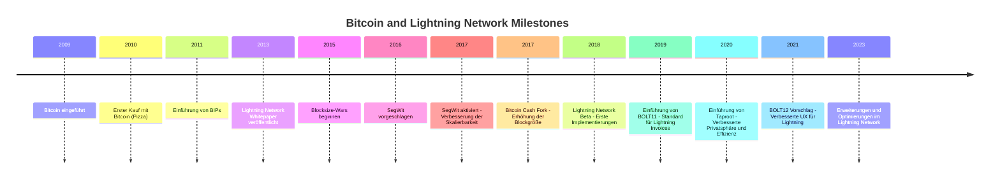

# 08:15–09:45 – Einstieg: Limitierungen von Bitcoin L1 und der Pfad zu Lightning L2
Gleich zum Start serviert Marcel Rapold einen Realitätscheck für alle mit Tech-/Finance-Background: Bitcoin Layer 1 ist bahnbrechend, aber eben kein Alleskönner. In einem pointierten Vortrag (mit dezentem Augenzwinkern) skizziert er, warum 7 Transaktionen pro Sekunde schlicht nicht reichen und wie die Community darauf reagiert hat. Dabei spannt er den Bogen von den frühen Skalierungsdebatten über die **Blocksize-Wars** bis zur Einführung von **SegWit 2017** als Grundlage für das Lightning Network. Selbst die legendäre *Blockstream-AXA-Verschwörungstheorie* kommt zur Sprache – immerhin behaupteten einige lautstark, Blockstream würde Bitcoin absichtlich "verkrüppeln", um dann das eigene Lightning-Produkt teuer zu verkaufen ([Bitcoin's Possible Privatization: Has Blockstream Created Problem to Provide Solution?](https://cointelegraph.com/news/bitcoins-possible-privatization-has-blockstream-created-problem-to-provide-solution#:~:text=%3E%20%E2%80%9CThese%20Blockstream,%E2%80%9D)). Marcel kommentiert solche Anekdoten trocken, was die Stimmung lockert. Natürlich wird auch die eigentliche Idee hinter Lightning erklärt: Transaktionen aus dem überlasteten L1 auslagern und off-chain nahezu in Echtzeit abwickeln. Hier erinnert Marcel daran, dass Lightning keine Magie, sondern cleveres Engineering (Stichwort: Payment-Channels) ist. Die Teilnehmenden – keine absoluten Anfänger, aber auch keine Hardcore-Bitcoiner – können Fragen einwerfen, etwa zum Unterschied zwischen **On-Chain** und **Off-Chain** oder zu Bitcoins Performance-Limits.

- **Themen:** Physikalische und protokollbedingte Limitierungen von Bitcoin L1 (Blockgröße, Transaktionsdurchsatz, Latenz), Motivation für Second-Layer-Lösungen; Grundprinzipien des Lightning Netzwerks (bidirektionale Zahlungskanäle, Off-Chain-Signaturen); historischer Kontext der Bitcoin-Skalierungsdiskussion (Forks wie Bitcoin Cash, SegWit-Aktivierung, Beiträge von Christian Decker und Co., inkl. Blockstream-Debatte und AXA-Einstieg ([Blockstream](https://blog.blockstream.com/en-blockstream-new-investors-55-million-series-a/#:~:text=Our%20latest%20round%20was%20led,joined%20our%20Board%20of%20Directors)) ([Blockstream](https://blog.blockstream.com/en-blockstream-new-investors-55-million-series-a/#:~:text=%E2%80%9CWe%20are%20convinced%20that%20blockchain,%E2%80%9D))).
- **Methode:** **Input-Vortrag** mit Folien und ausgewählten Charts. Marcel streut bewusst Fragen ins Plenum („Wieviel TPS schafft eurer Meinung nach Visa im Vergleich zu Bitcoin?“) und **moderiert eine kurze Diskussion**. Das Vorwissen der 15 Teilnehmenden wird so aktiviert – die meisten kennen Begriffe wie *Blockchain* und *Hashrate*, aber hier wird ihr Fokus auf das Lightning-Thema gelenkt. Dank pointierter Vergleiche (z. B. Lightning-Transaktionen vs. Kreditkartenzahlungen) und einer Prise Zynismus bleibt die Aufmerksamkeit hoch.
- **Hilfsmittel:** Präsentation mit Grafiken (Beamer) – darunter ein Diagramm, das Bitcoins Transaktionslimit illustriert und wie Lightning als Schicht obendrauf sitzt. Flipchart für spontane Skizzen (z. B. ein schematischer Vergleich *On-Chain-Transaktion vs. Lightning-Transaktion*). Marcel hat zudem ein Chart parat, das die Timeline der Ereignisse (Forks, SegWit) zeigt, um die historischen Meilensteine sichtbar zu machen.

## Bitcoin Timeline

